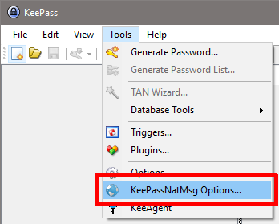
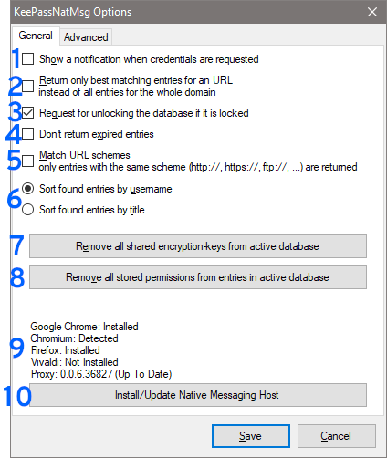
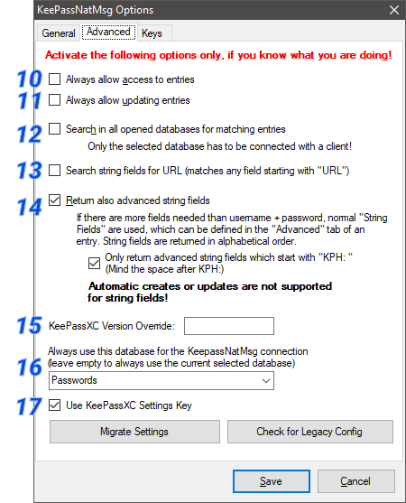

# KeePassNatMsg

is a plugin for KeePass 2.x and provides a secure means of exposing KeePass credentials to a browser via [Native Messaging](https://developer.mozilla.org/en-US/Add-ons/WebExtensions/Native_messaging).

It is based on [KeePassHttp](https://github.com/pfn/keepasshttp).

This plugin is primarily intended for use with the [keepassxc-browser](https://github.com/keepassxreboot/keepassxc-browser) browser extension.

## Features
 * returns all matching entries for a given URL
 * updates entries
 * secure exchange of entries
 * notifies user if entries are delivered
 * user can allow or deny access to single entries
 * works only if the database is unlocked
 * request for unlocking the database if it is locked while connecting
 * searches in all opened databases (if user activates this feature)
 * Whenever events occur, the user is prompted either by tray notification or requesting interaction (allow/deny/remember).

## System requirements
 * KeePass 2.17 or higher
 * For Windows: .NET Framework 4.0 or higher
 * For Linux: Mono 4.0 or higher
 * For Mac: Mono 4.0 or higher (untested)

## Installation

 1. Download the latest [KeePassNatMsg](https://github.com/smorks/keepassnatmsg/releases) release
 2. Unzip it into the KeePass\Plugins directory
	* default directory in Ubuntu14.04: /usr/lib/keepass2/
	* default directory in Arch: /usr/share/keepass
 3. On linux systems you maybe need to install mono-complete: `$ apt-get install mono-complete` (in Debian it should be enough to install the packages libmono-system-runtime-serialization4.0-cil and libmono-posix2.0-cil)
 * Tips to run KeePassNatMsg on lastest KeePass 2.31: install packages
 	`sudo apt-get install libmono-system-xml-linq4.0-cil libmono-system-data-datasetextensions4.0-cil libmono-system-runtime-serialization4.0-cil mono-mcs`
 4. Restart KeePass
 5. Go to Tools -> KeePassNatMsg Options
 6. Click on "Install/Update Native Messaging Host", wait for message telling you it was intalled.

### KeePassNatMsg on Linux and Mac

KeePass needs Mono. You can find detailed [installation instructions on the official page of KeePass](http://keepass.info/help/v2/setup.html#mono).

## Configuration and Options

KeePassNatMsg works out-of-the-box. You don't have to explicitly configure it.

 * KeePassNatMsg stores shared public keys in "KeePassNatMsg Settings" in the root group of a password database.
 * Password entries saved by KeePassNatMsg are stored in a new group named "KeePassNatMsg Passwords" within the password database.
 * Remembered Allow/Deny settings are stored as JSON in custom string fields within the individual password entry in the database.

### Settings in KeePassNatMsg options.

You can open the options dialog with menu: Tools > KeePassNatMsg Options

The options dialog will appear:

General tab

1. show a notification balloon whenever entries are delivered to the inquirer.
2. returns only the best matching entries for the given url, otherwise all entries for a domain are send.
  - e.g. of two entries with the URLs http://example.org and http://example.org/, only the second one will returned if the requested URL is http://example.org/index.html
3. if the active database in KeePass is locked, KeePassNatMsg sends a request to unlock the database. Now KeePass opens and the user has to enter the master password to unlock the database. Otherwise KeePassNatMsg tells the inquirer that the database is closed.
4. expired entries are not ignored if enabled.
5. KeePassNatMsg returns only these entries which match the scheme of the given URL.
  - given URL: https://example.org --> scheme: https:// --> only entries whose URL starts with https://
6. sort found entries by username or title.
7. removes all shared encryption-keys which are stored in the currently selected database. Every inquirer has to reauthenticate.
8. removes all stored permissions in the entries of the currently selected database.
9. Shows the status of the Native Messaging Host installations for the supported browsers, and the current Proxy version.
10. Installs or Updates the Native Messaging Host, and updates the Proxy if an update is available.

Advanced tab

11. KeePassNatMsg no longer asks for permissions to retrieve entries, it always allows access.
12. KeePassNatMsg no longer asks for permission to update an entry, it always allows updating them.
13. Searching for entries is no longer restricted to the current active database in KeePass but is extended to all opened databases!
  - __Important:__ Even if another database is not connected with the inquirer, KeePassNatMsg will search and retrieve entries of all opened databases if the active one is connected to KeePassNatMsg!
14. if activated KeePassNatMsg also search for string fields which are defined in the found entries and start with "KPH: " (note the space after colon). __The string fields will be transfered to the client in alphabetical order__. You can set string fields in the tab _Advanced_ of an entry.  

## Tips and Tricks

### Support multiple URLs for one username + password
This is already implemented directly in KeePass.

1. Open the context menu of an entry by clicking right on it and select _Duplicate entry_:  

2. Check the option to use references for username and password:  

3. You can change the title, URL and evertything of the copied entry, but not the username and password. These fields contain a _Reference Key_ which refers to the _master entry_ you copied from.

## Troubleshooting

__First:__ If an error occures it will be shown as notification in system tray or as message box in KeePass.

Otherwise please check if it could be an error of the client you are using. For keepassxc-browser issues you can [report an error here](https://github.com/varjolintu/keepassxc-browser/issues/).

If you are having problems with KeePassNatMsg, please tell us at least the following information:
* operating system & version
* version of KeePass
* version of KeePassNatMsg
* error message (if available)
* used clients and their versions
* URLs on which the problem occur (if available)

## URL matching: How does it work?

KeePassNatMsg can receive 2 different URLs, called URL and SubmitURL.

CompareToUrl = SubmitURL if set, URL otherwise

For every entry, the [Levenshtein Distance](http://en.wikipedia.org/wiki/Levenshtein_distance) of his Entry-URL (or Title, if Entry-URL is not set) to the CompareToURL is calculated.

Only the Entries with the minimal distance are returned.

###Example:
Submit-Url: http://www.host.com/subdomain1/login

Entry-URL|Distance
---|---
http://www.host.com/|16
http://www.host.com/subdomain1|6
http://www.host.com/subdomain2|7

__Result:__ second entry is returned

## Protocol

View [detailed protocol information](https://github.com/varjolintu/keepassxc-browser/blob/master/keepassxc-protocol.md).
